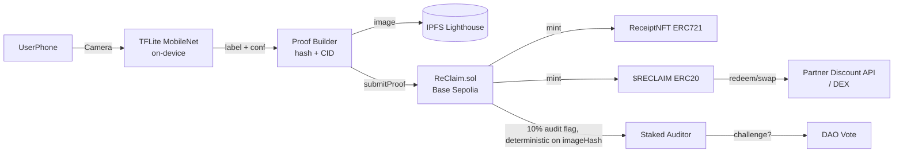

# Architecture — ReClaim

## Diagram (Mermaid)

## Contracts

### ReClaim.sol
- `mapping(bytes32 imageHash => bool) usedHashes` — prevents replay
- `mapping(address => uint) stakes` for auditors
- `submitProof(uint8 material, uint8 confidence, string cid, bytes32 hash)` — validates, mints, triggers lottery
- `challenge(uint tokenId)` — auditor stakes, triggers review
- `rewardTable[6]` — governance updatable

### ReClaimToken.sol (ERC20)
- `mint(address to, uint amount)` only callable by ReClaim
- Fixed supply logic, no pre-mine except rewards

### ReceiptNFT.sol (ERC721)
- `tokenURI` returns IPFS metadata JSON
- Enumerable, burns on successful challenge

## AI Pipeline

- Base: MobileNetV2 224x224, TensorFlow.js
- No fine-tune. Stock MobileNet v2 ImageNet weights, run in the browser
- ImageNet classes are mapped onto 6 materials by a curated label map in `frontend/lib/classify.ts`
- Accuracy on real waste is bounded by what ImageNet already knows. Unmapped or sub-85% predictions are refused, not guessed
- Threshold: <85 confidence → reject, suggest retake
- Runs on-device, no image leaves phone before hash (privacy)

## Frontend

- Next.js 14 App Router, TypeScript
- wagmi v2 + viem, injected wallet connector
- `app/page.tsx` (camera + UI), `lib/classify.ts` (MobileNet), `lib/proof.ts` (keccak256 + pinning)
- `lib/ipfs.ts` — Lighthouse upload
- `lib/contract.ts` — viem write calls

## Security Considerations

- ReentrancyGuard on mint
- Image hash prevents duplicate across users
- No location data is collected. GPS clustering is not implemented
- Auditor stakes 100 $RECLAIM and bonds 50 per challenge. A wrong challenge forfeits the bond to `slashPool`. A correct one burns the receipt and claws the reward back

## Gas

- Base Sepolia: submitProof ~ 120k gas (~$0.008)
- Optimized with custom errors, unchecked increments

## Deployment

- Network: Base Sepolia (84532)
- Verifier: Etherscan
- Deployment script: `contracts/scripts/deploy.js` using Hardhat
