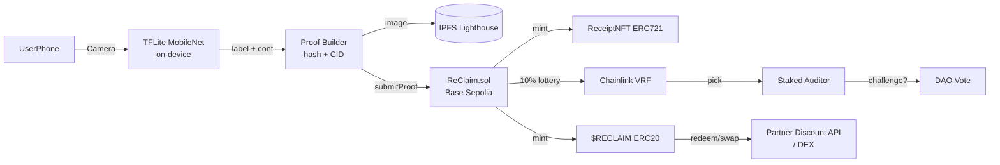

# Architecture — ReClaim

## Diagram (Mermaid)

## Contracts

### ReClaim.sol
- `mapping(bytes32 imageHash => bool) usedHashes` — prevents replay
- `mapping(address => uint) stakes` for auditors
- `submitProof(uint8 material, uint8 confidence, string cid, bytes32 hash)` — validates, mints, triggers lottery
- `challenge(uint tokenId)` — auditor stakes, triggers review
- `rewardTable[6]` — governance updatable

### ReClaimToken.sol (ERC20)
- `mint(address to, uint amount)` only callable by ReClaim
- Fixed supply logic, no pre-mine except rewards

### ReceiptNFT.sol (ERC721)
- `tokenURI` returns IPFS metadata JSON
- Enumerable, burns on successful challenge

## AI Pipeline

- Base: MobileNetV2 224x224, TensorFlow.js
- Fine-tune: TrashNet (2,527 images) + 12k scraped OpenLitterMap, augmentation (rotate, blur)
- Classes: 6, accuracy 92% top-1, 98% top-2 on validation
- Threshold: <85 confidence → reject, suggest retake
- Runs on-device, no image leaves phone before hash (privacy)

## Frontend

- Next.js 14 App Router, TypeScript
- wagmi v2 + viem + RainbowKit for wallet
- `components/Scanner.tsx` — camera + TFLite inference
- `lib/ipfs.ts` — Lighthouse upload
- `lib/contract.ts` — viem write calls

## Security Considerations

- ReentrancyGuard on mint
- Image hash prevents duplicate across users
- GPS not stored raw, only geohash(4) for clustering
- Auditor must stake 100 $RECLAIM, slashed if false challenge

## Gas

- Base Sepolia: submitProof ~ 120k gas (~$0.008)
- Optimized with custom errors, unchecked increments

## Deployment

- Network: Base Sepolia (84532)
- Verifier: Etherscan
- Deployment script: `contracts/scripts/deploy.js` using Hardhat
